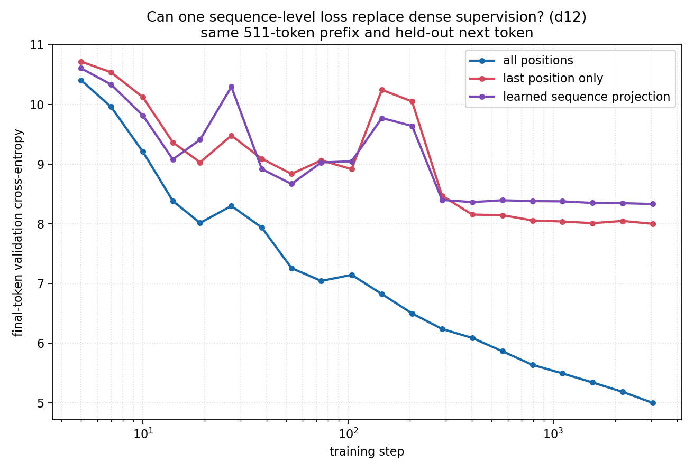
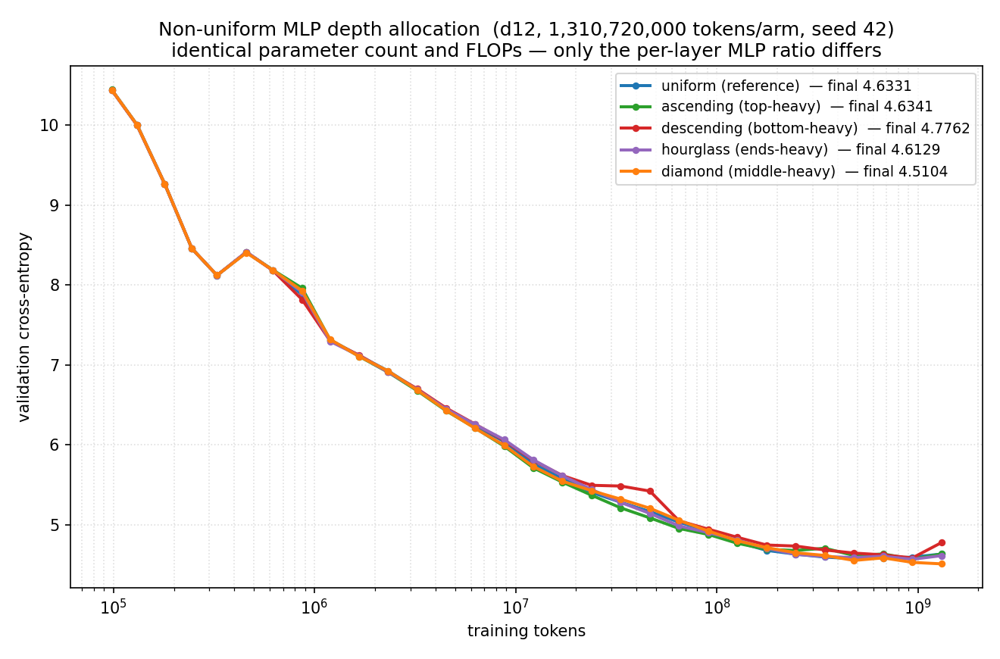
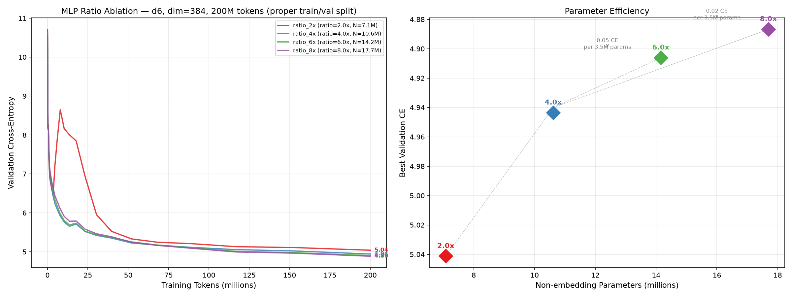

# understand transformers by ablation

A gallery of controlled transformer experiments: remove or swap ONE thing, train it against a baseline, read the two curves. Each experiment is a **self-contained folder** built on [nanoinfra](https://github.com/suning-git/nanoinfra).

## Run an experiment

```bash
git clone <this repo> && cd <this repo>
python -m venv .venv && . .venv/bin/activate   # a fresh virtualenv
pip install -r requirements.txt                # installs nanoinfra (the framework) as a library
python download_data.py                        # fetch a couple of FineWeb shards
python -m modalities.text.train_tokenizer      # train the tokenizer artifact (seconds)

cd suning/example_gpt2_vs_modern               # any experiment folder
python run.py                                  # train the arms (needs a CUDA GPU)
python plot.py                                 # -> the figure
```

Each folder names its trunk as a LOCAL module and finds nanoinfra automatically, so it runs from wherever it sits — nothing to place under nanoinfra by hand. `download_data.py` puts FineWeb under `./outputs`; override the location with `NANOINFRA_BASE_DIR`.

## Contribute your own

Fork this repo, add a folder `<yourname>/<your_experiment>/` (copy an existing one as a template — `spec.py` + `run.py` + `plot.py` + a local trunk module + a `README.md` with your finding), and open a pull request. One subdirectory per contributor: your PR only touches your own folder, so it never conflicts with anyone else.

---

### [ReLU² → GELU Activation Ablation](ablations_shibo_dai/gelu_ablation/)
`ablations_shibo_dai/gelu_ablation` · ablations_shibo_dai

Negligible difference (Δ = 0.012 CE). ReLU² is a close numerical


### [QK-Norm Ablation](ablations_shibo_dai/qk_norm_ablation/)
`ablations_shibo_dai/qk_norm_ablation` · ablations_shibo_dai

No meaningful impact (Δ = 0.003 CE). QK-Norm is redundant at depth 6


### [RoPE → Learned Position Embedding Ablation](ablations_shibo_dai/rope_ablation/)
`ablations_shibo_dai/rope_ablation` · ablations_shibo_dai

RoPE provides a meaningful +0.266 CE improvement over learned


### [RoPE (Rotary Position Embedding) ablation](jiayq/rope_ablation/)
`jiayq/rope_ablation` · jiayq


### [Attn:MLP ratio ablation](linzh/attn_mlp_ratio/)
`linzh/attn_mlp_ratio` · linzh


### [Can one sequence-level loss replace dense next-token supervision?](ra88/next_token_supervision_ablation/)
`ra88/next_token_supervision_ablation` · ra88




### [example: GPT-2 vs a modern architecture](suning/example_gpt2_vs_modern/)
`suning/example_gpt2_vs_modern` · suning


### [example: residual-connection ablation](suning/example_residual_ablation/)
`suning/example_residual_ablation` · suning

Remove the


### [RoPE frequency study](suning/rope_study/)
`suning/rope_study` · suning


### [non-uniform MLP depth allocation (D12, 1.31B tokens/arm, single seed)](wangbingfu3-ctrl/nonuniform_mlp_depth/)
`wangbingfu3-ctrl/nonuniform_mlp_depth` · wangbingfu3-ctrl




### [MLP Expansion Ratio Ablation](qw/mlp_ratio_ablation/)
`qw/mlp_ratio_ablation` · 邱文

Compare 2x/4x/6x/8x MLP ratios — 8x wins at 200M tokens but returns diminish sharply (Δ < 0.05 CE vs 4x).



