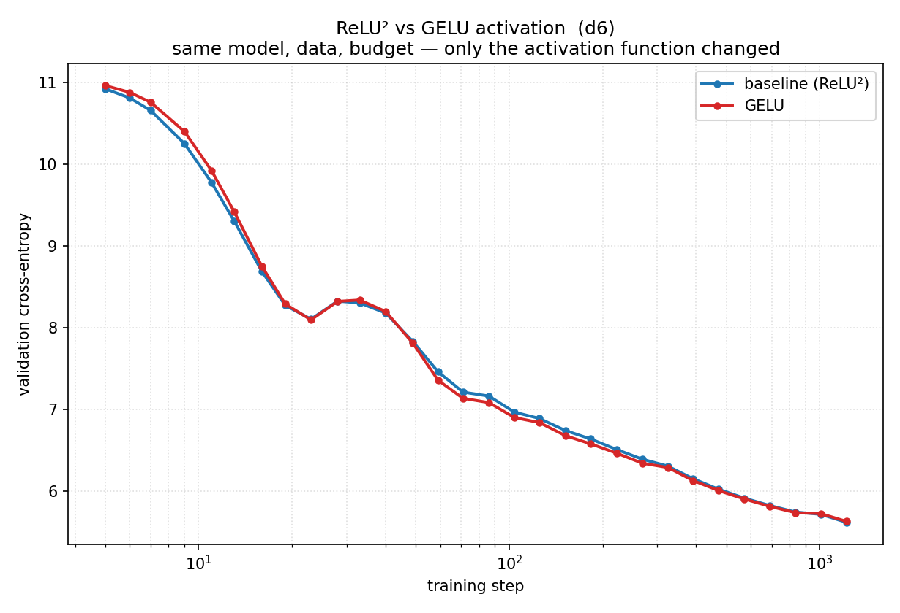

# ReLU² → GELU Activation Ablation

**Hypothesis:** Replacing the modern ReLU² activation with classic GELU will slightly degrade validation loss.

**Experiment:**
- Control variable: swap `F.relu(x).square()` → `F.gelu(x)` in the MLP
- Model: d6 (depth=6, dim=384, ~10.6M params)
- Data: FineWeb sample-10BT, 20M tokens (1220 steps)
- Optimizer: AdamW, lr=3e-4, constant LR after 100 warmup steps, batch size 16384
- 30 log-spaced eval points per arm

**Results:**

| arm | val CE (start → end) |
|-----|----------------------|
| baseline (ReLU²) | 10.925 → 5.619 |
| gelu (GELU) | 10.965 → 5.631 |

**Conclusion:** Negligible difference (Δ = 0.012 CE). ReLU² is a close numerical
approximation of GELU, confirming that modern transformers lose nothing by
switching to the simpler, faster activation. This is a pure engineering
improvement with no accuracy cost.

**Control check:** same model, data, optimizer, seed — only the activation function differs.
