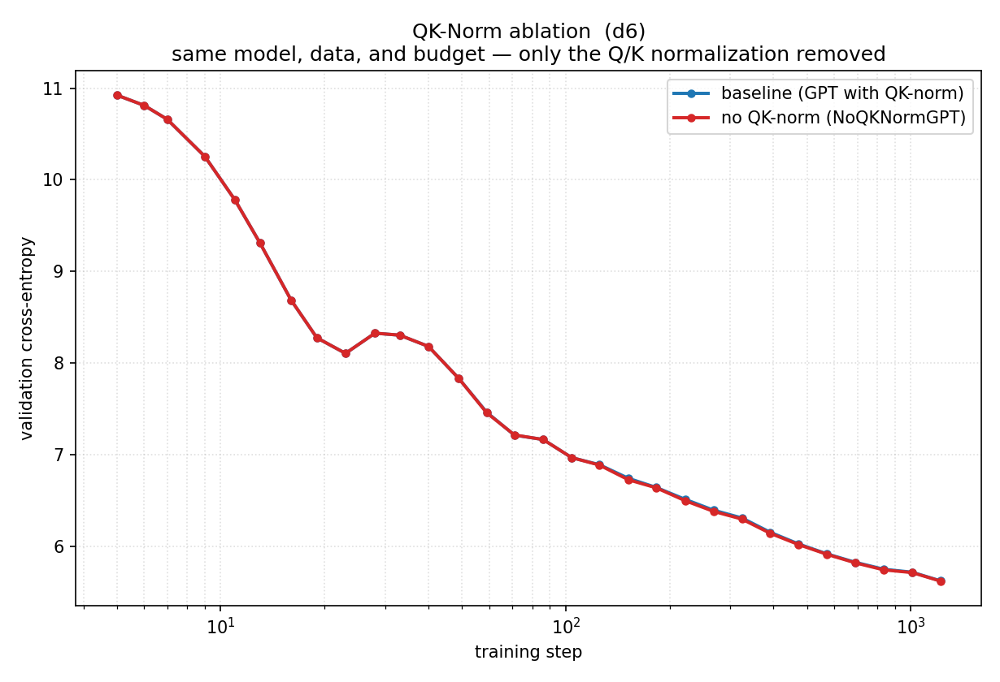

# QK-Norm Ablation

**Hypothesis:** Removing per-head Q/K normalization in attention will destabilize training and increase validation loss.

**Experiment:**
- Control variable: delete `q, k = norm(q), norm(k)` (one line in `CausalSelfAttention.forward`)
- Model: d6 (depth=6, dim=384, ~10.6M params)
- Data: FineWeb sample-10BT, 20M tokens (1220 steps)
- Optimizer: AdamW, lr=3e-4, constant LR after 100 warmup steps, batch size 16384
- 30 log-spaced eval points per arm

**Results:**

| arm | val CE (start → end) |
|-----|----------------------|
| baseline (with QK-Norm) | 10.925 → 5.622 |
| no_qk_norm (removed) | 10.925 → 5.619 |

**Conclusion:** No meaningful impact (Δ = 0.003 CE). QK-Norm is redundant at depth 6
because the block input is already normalized by RMSNorm before projection.
The Q/K value variance stays within a reasonable range naturally.
We expect the gap to widen at depth 20+, where activations drift more across layers.

**Control check:** same model, data, optimizer, seed (42), budget — only the single norm line differs.
