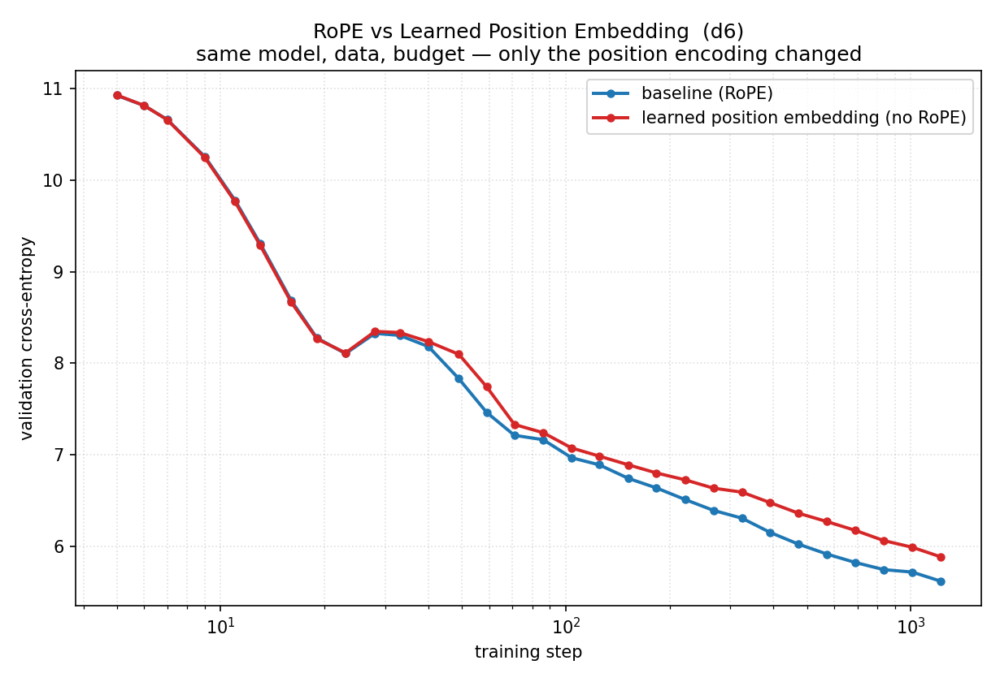

# RoPE → Learned Position Embedding Ablation

**Hypothesis:** Rotary Position Embedding (RoPE) outperforms GPT-2-style learned
absolute position embeddings (wpe), especially on longer sequences.

**Experiment:**
- Control variable: replace RoPE (rotation inside every attention layer) with a
  learned position embedding table added once at the embedding level (wpe).
- Model: d6 (depth=6, dim=384, ~10.6M params), seq_len=512
- Data: FineWeb sample-10BT, 20M tokens (1220 steps)
- Optimizer: AdamW, lr=3e-4, constant LR after 100 warmup steps, batch size 16384
- 30 log-spaced eval points per arm

**Results:**

| arm | val CE (start → end) |
|-----|----------------------|
| baseline (RoPE) | 10.925 → **5.620** |
| no_rope (learned PE) | 10.928 → **5.886** |

**Conclusion:** RoPE provides a meaningful +0.266 CE improvement over learned
absolute position embeddings. The two curves nearly overlap early in training,
but learned PE clearly falls behind at mid-to-late steps — RoPE's advantage
lies in better modeling long-range positional relationships.
This gap appears even at seq_len=512, suggesting RoPE matters well before
very long contexts.

**Control check:** same model, data, optimizer, seed (42), budget — only the
position encoding scheme differs. Note: learned PE adds `seq_len × n_embd`
extra parameters (~200K), negligible relative to the 10.6M total.
