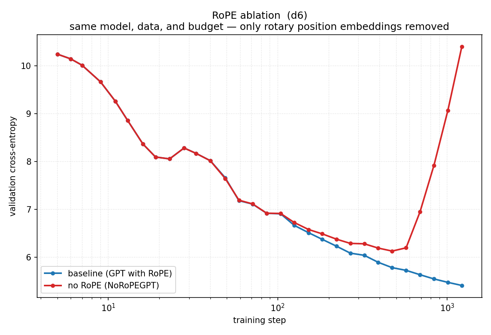

# RoPE (Rotary Position Embedding) ablation

A **negative ablation** that removes **RoPE** from the transformer's attention
and measures what it costs: same model, same data, same budget, one
architectural change, two training curves.

## The ablation

In the standard transformer, each attention layer applies RoPE to Q and K
before computing attention — this injects position information into the
otherwise order-blind dot product:

```python
# baseline: Core model GPT with RoPE
cos, sin = cos_sin
q, k = apply_rotary_emb(q, cos, sin), apply_rotary_emb(k, cos, sin)
```

`trunk.py` removes this step — nothing else changes:

```python
# ablated: RoPE removed
# q, k stay as-is — attention has zero positional information
```

That is the whole change. RoPE is what lets attention distinguish "A B" from
"B A"; without it the model has to rely solely on token identity.

## How it's wired

No core edit, no forked training loop. `NoRoPEGPT` (`trunk.py`) subclasses the
reference GPT and swaps in `NoRoPEAttention` — the same trunk contract, the
same orchestrator (`modalities.text.train_text`), one config knob
(`model.trunk_class`).

| file | what |
|------|------|
| `trunk.py` | `NoRoPEGPT` — skips `apply_rotary_emb` in every attention layer |
| `spec.py`  | the recipe (depth, budget, the two arms) — the one knob |
| `run.py`   | trains both arms through the orchestrator, collects the val curves |
| `plot.py`  | the two curves → `rope_ablation.png` |

## Run it

```bash
# from the repo root (with nanoinfra installed + FineWeb data present)
cd jiayq/rope_ablation
python run.py      # trains baseline + no_rope (d6, ~10 minutes on one GPU)
python plot.py     # -> rope_ablation.png
```

Defaults to a tiny **d6** smoke scale (a couple of minutes on one GPU). Raise
`DEPTH` in `spec.py` and the gap only grows.

## Result



The two arms start together at the trivial init loss (~10.2 CE), descend
together for the first ~300 steps — then the no-RoPE model **reverses** and
collapses back to random:

| arm | val CE @ step 5 | val CE @ minimum | val CE @ end (step 1219) |
|-----|----------------:|----------------:|-------------------------:|
| baseline (GPT) | 10.24 | — | **5.42** |
| no RoPE        | 10.24 | **6.13** (@ step 473) | **10.40** |

### The three-phase collapse

1. **Steps 1–500** (CE 10.24 → 6.13): Without RoPE, attention can still learn
   position-independent statistics — which words are common, what word pairs
   frequently co-occur. The no-RoPE model keeps pace with the baseline.

2. **Steps 500–700** (CE 6.13 → 6.95): The turn. The model starts trying to
   learn finer linguistic structure — grammar, syntax, phrase ordering —
   which requires knowing **which token came first**. Without position
   information, conflicting gradient signals ("sometimes A B is right,
   sometimes B A is") begin accumulating.

3. **Steps 700–1220** (CE 6.95 → 10.40): **Catastrophic forgetting**. The
   accumulated conflicts destroy the representations learned earlier, and the
   model collapses all the way back to random-guess CE. It reaches the same
   loss at step 1219 as it had at step 5 — the full 1220 steps were wasted.

> The gap at the final step is **+5.0 CE** — twice the deficit of removing
> residual connections (+2.4 CE in
> [suning/example_residual_ablation](../suning/example_residual_ablation/)).

## Conclusion

**RoPE is not an optimization — it is infrastructure.** Without position
information in attention, the model first learns surface statistics, then
self-destructs as it tries and fails to acquire syntax. The loss floor of
~6.1 CE (step 473) is the best a transformer can do on language without
knowing token order — and that floor is **unstable**.
