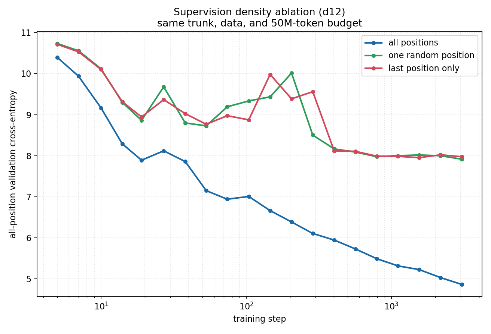

# Can one sequence-level loss replace dense next-token supervision?

**Author:** zhang leizhi / 张雷智

## TL;DR

A causal language model normally gets one next-token target at every position. I
tested whether one target per sequence is enough, and whether a learned projection
over all hidden states is a better single-target readout than using the final hidden
state directly.

It is not, at this scale. On a shared final-token task, dense all-position training
reaches **5.0015 CE**, last-position-only training reaches **7.9987**, and the learned
sequence projection reaches **8.3309**. The projection uses information from every
position, but it does not recover the training signal lost by discarding the other
510 next-token targets.


## Question

Why does the classic causal-LM objective supervise every sequence position? A
single 512-token training sequence already produces hidden states for the whole
prefix. Could we compress those states into one vector and train on one final-token
prediction instead?

The experiment separates three possible effects:

1. **Supervision density:** 511 targets versus one target per sequence.
2. **Target location:** one random target versus the final target.
3. **Sequence readout:** the final hidden state versus a learned projection over all
   hidden states.

## Compared designs

All arms use the same GPT trunk, FineWeb data, initialization, optimizer, learning
rate, sequence length, and 50M-token training budget.

| arm | training targets per sequence | representation sent to LM head |
|---|---:|---|
| `all_positions` | 511 | every causal hidden state |
| `random_position` | 1 | every state is computed; one random loss is kept |
| `last_position` | 1 | every state is computed; only the final loss is kept |
| `projected_sequence` | 1 | learned weighted sum of all states; head runs once |

The projected readout is

\[
\alpha = \operatorname{softmax}(a), \qquad
z = \sum_t \alpha_t h_t, \qquad
\mathcal{L} = \operatorname{CE}(Wz, y_{\mathrm{final}}).
\]

The positional weights `a` and the vocabulary projection `W` are trained jointly
with the Transformer. The projected and last-position arms therefore have the same
single final-token target; their controlled difference is how the sequence hidden
states are read out.

The data recipe uses raw `text_tokens` without a fixed trailing EOS control token.
Otherwise, literal last-position supervision would collapse into predicting EOS.

## Primary result: shared final-token benchmark

The primary benchmark gives every model the same 511-token held-out prefix and
scores only the immediately following token over 2,048 validation sequences. This
is the projected model's native interface and is directly comparable across all
three relevant training designs.

| training objective | final-token CE | BPB | top-1 accuracy |
|---|---:|---:|---:|
| all positions | **5.0015** | **1.6047** | **24.61%** |
| last position only | 7.9987 | 2.5663 | 8.45% |
| learned sequence projection | 8.3309 | 2.6729 | 3.76% |

Dense supervision remains **2.9972 nats better** than last-only training even when
evaluation scores only the final token. Its advantage is therefore not an artifact
of evaluating more positions. The learned projection is finite and trainable, but
finishes **0.3322 nats worse** than the direct final-state readout.

The learned pooling is not exactly uniform. At the end of the run it assigns 36.26%
of its mass to the last quarter of the sequence (25% would be uniform), and the
final position receives about 3.36 times its uniform weight. It still retains a
diffuse mixture of early and late positions. Access to all states alone is not
enough to replace dense token-level labels.

## Supporting ablation: density and position

For standard causal-LM validation CE, only heads that produce a prediction at every
position are compared. The projected model is intentionally excluded from this
plot because forcing its sequence-level head to score individual positions changes
the evaluation interface.



| training objective | standard validation CE at step 3,050 |
|---|---:|
| all positions | **4.8626** |
| one random position | 7.9148 |
| last position only | 7.9746 |

The two single-target controls differ by only 0.0598 nats, while both trail dense
supervision by more than 3 nats. A smaller d6/20M-token replication gives 5.3308,
8.0021, and 7.9717 CE respectively. The random-versus-last ordering reverses across
the two runs, so the robust effect is supervision density, not target location.

## Interpretation

The sequence projection tests a stronger idea than merely keeping the last loss:
its prediction can directly combine every causal hidden state. Its negative result
suggests two limitations of sequence-to-one training for autoregressive language
modeling:

- One label supplies far less token-level error information per sequence. Dense
  supervision turns each prefix into a separate learning problem and updates the
  embedding, trunk, and head from all of them.
- Pooling before the vocabulary head introduces an information bottleneck. The
  model must learn both which positions matter and how to encode all predictive
  information into one vector from the same sparse final-token signal.

This result does not show that every possible sequence-level objective must fail.
It shows that this simple learned positional projection does not compensate for
the removed next-token targets under a matched data and training-step budget.

## Limitations

- The d12 result uses one seed and one model/data scale.
- Training input tokens and trunk work are matched, but exact FLOPs are not: the
  projected vocabulary head runs once per sequence while the current last-only
  implementation still constructs logits at every position.
- The observed throughput difference is therefore not reported as a fair speedup.
  A proper systems comparison needs an optimized last-only head that gathers the
  final hidden state before vocabulary projection.
- Only one softmax-constrained, position-only projection was tested. Content-aware
  attention pooling or multiple pooled targets are separate follow-up designs.

## Files

| file | role |
|---|---|
| `supervision.py` | random- and last-position target masks |
| `projected_head.py` | learned sequence projection and single LM-head call |
| `final_token_evaluator.py` | shared prefix-to-next-token evaluator |
| `sitecustomize.py` | process-local hooks into nanoinfra; no core files are edited |
| `spec.py` | controlled d12/50M recipe and arm definitions |
| `run.py` | standard all/random/last supervision experiment |
| `run_final_benchmark.py` | shared all/last/projected final-token experiment |
| `plot.py` | regenerates both committed figures |
| `test_supervision.py` | mask and projected-head gradient self-test |
| `results/` | parsed trajectories and timing summaries; no raw logs or checkpoints |

## Reproduce

From the root of this repository:

```bash
python -m venv .venv
. .venv/bin/activate
pip install -r requirements.txt
python download_data.py

cd ra88/next_token_supervision_ablation
python test_supervision.py
python run.py
python run_final_benchmark.py
python plot.py
```

`run.py` trains three arms and `run_final_benchmark.py` trains three arms. On the
RTX PRO 6000 used here, the complete d12 experiment took approximately 34 minutes,
excluding environment setup and data download. Use `python run.py --smoke` and
`python run_final_benchmark.py --smoke` to verify the environment first.
