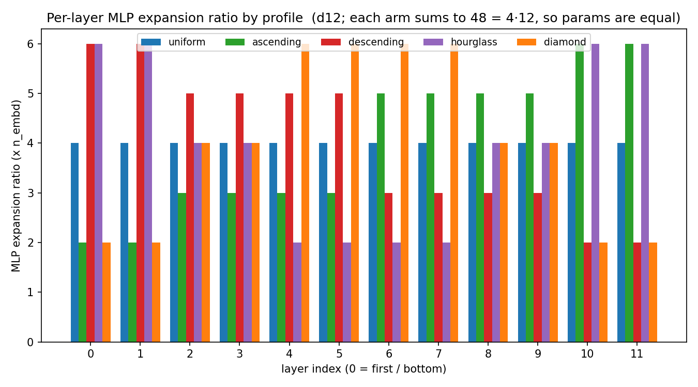

# non-uniform MLP depth allocation (D12, 1.31B tokens/arm, single seed)

A **controlled allocation ablation**. Hold the total MLP parameter budget fixed
— same model size, same data, same optimizer, same token budget — and ask:
**does it matter WHERE along depth the MLP capacity sits?**

The reference GPT gives every transformer block the same MLP width
(`4 * n_embd`). This experiment instead gives each layer its own integer
expansion ratio, chosen from one of five named *profiles*, while constraining
the ratios to sum to `4 * depth`. So all five arms have **exactly the same
parameter count (162,203,904) and the same FLOPs per token** — the only thing
that differs is the *shape* of MLP capacity over depth.

| profile | where the capacity sits | d12 ratios (bottom→top) |
|---------|------------------------|--------------------------|
| **uniform** | nowhere — flat (the reference GPT) | `4 4 4 4 4 4 4 4 4 4 4 4` |
| **ascending** | toward the top (last layers) | `2 2 3 3 3 3 5 5 5 5 6 6` |
| **descending** | toward the bottom (first layers) | `6 6 5 5 5 5 3 3 3 3 2 2` |
| **hourglass** | heavy at both ends | `6 6 4 4 2 2 2 2 4 4 6 6` |
| **diamond** | heavy in the middle | `2 2 4 4 6 6 6 6 4 4 2 2` |

## The result (caveat up front: single seed, ~0.4x Chinchilla — see Limitations)


Final validation cross-entropy, sorted best→worst:

| rank | arm | final val CE | Δ vs uniform |
|------|-----|-------------:|-------------:|
| 1 | **diamond** | **4.5104** | **−0.1227** |
| 2 | hourglass | 4.6129 | −0.0202 |
| 3 | uniform | 4.6331 | 0.0 (ref) |
| 4 | ascending | 4.6341 | +0.0010 |
| 5 | descending | 4.7762 | +0.1431 |

**Headline: middle-heavy (`diamond`) wins and bottom-heavy (`descending`) is
worst, by margins (~0.12 and ~0.14 CE) that are large for a parameter-matched
comparison.** The per-layer profile figure makes the intuition visible:



A provocative detail: a much shorter prior run of these same five arms (~20M
tokens) ranked `ascending` first. At 1.31B tokens that ordering is gone —
`ascending` collapses to uniform-parity while `diamond` takes over. **The
optimal depth profile is not compute-invariant**; that reordering is the most
interesting thing here, and the main reason a multi-seed follow-up matters.

## How it's wired

No core edit, no forked training loop. `trunk.py` defines a `ProfiledGPT` base
plus four profile trunks (`AscendingGPT` / `DescendingGPT` / `HourglassGPT` /
`DiamondGPT`, all subclassing the reference `GPT`) that swap in a per-layer
variable-width MLP. Each satisfies the same trunk contract, so it drives through
the **same** blessed orchestrator (`modalities.text.train_text`) — selected by
one config knob, `model.trunk_class`. That is the framework's pluggable-trunk
seam: to change the architecture you provide a trunk, you do not patch the
shared core.

| file | what |
|------|------|
| `trunk.py` | `ProfiledGPT` + the four profile trunks — the architecture change |
| `spec.py`  | the recipe (depth, budget, the five arms) — the one knob |
| `run.py`   | trains all five arms through the orchestrator, collects the val curves |
| `plot.py`  | curves → `nonuniform_mlp.png` + `figures/profiles.png` |

## Run it

```bash
python download_data.py        # once: fetch FineWeb shards (repo root)
python run.py                  # trains all 5 arms (see wall-clock note)
python plot.py                 # -> nonuniform_mlp.png, figures/profiles.png
```

**Wall-clock reality.** At DEPTH=12 and 1.31B tokens/arm, one arm is hours and
five arms run sequentially is most of a day. The shipped curves were produced by
running the five arms concurrently on 2× H800 (three arms on GPU 0, two on GPU
1), finishing in ~7 h. `run.py` is the simple sequential driver; replicate the
concurrent run by launching each arm in its own process with
`CUDA_VISIBLE_DEVICES` pinned per arm.

## Limitations — read these before quoting a number

This is a **single seed (n=1)** at **~0.4× the Chinchilla-optimal budget**.
Every claim above is graded by that.

- **Single seed (42).** No error bars, no paired test. The fine ordering of the
  middle three arms (`hourglass` / `uniform` / `ascending`, all within
  Δ ∈ [−0.02, +0.001]) is inside single-seed noise and should not be over-read.
- **`hourglass` at #2 is probably noise.** This profile is high-variance and
  seed-42 happens to favor it; the #2 here likely does not reproduce. Treat only
  `diamond > uniform` and `descending` worst as the load-bearing signals — both
  are consistent with the shorter prior run as well.
- **~0.4× Chinchilla, not compute-optimal.** True Chinchilla for 162M params is
  ~3.24B tokens/arm (20 tok/param); this run used 1.31B (~8 tok/param), trimmed
  to fit a single overnight. It is ~65× the prior 20M run — enough to expose
  that the ranking is compute-sensitive — but full Chinchilla is still future
  work.
- **One architecture, one LR, one metric.** Still nanoinfra's pre-norm ReLU² GPT,
  fixed LR 3e-4, validation cross-entropy only. No per-profile LR search, no
  other model families.

**Bottom line (directional, single seed):** with a fixed MLP parameter budget,
concentrating capacity in the **middle** of the stack (`diamond`) beats
spreading it uniformly, and concentrating it at the **bottom** (`descending`)
is clearly worst. Where the top-heavy advantage seen at short horizon goes
under more compute is the open question a multi-seed, full-budget run should
answer.
